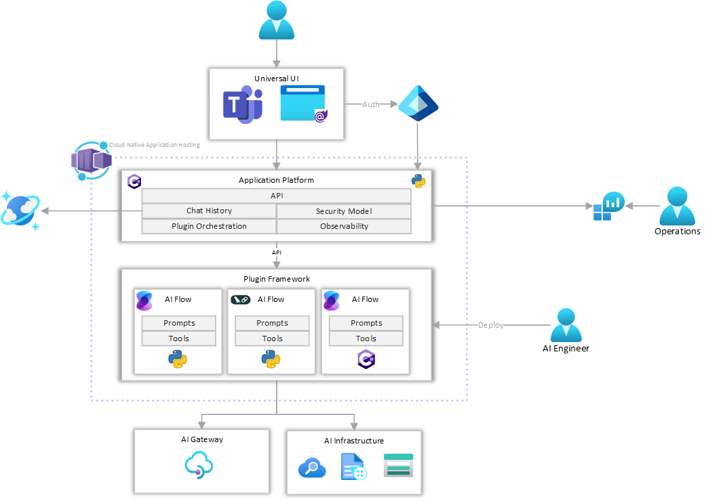
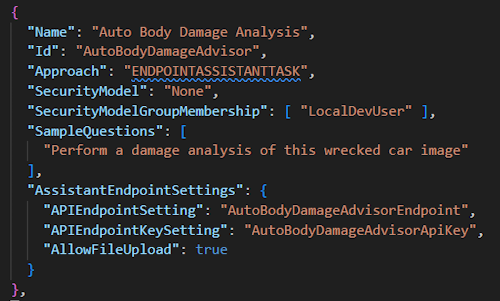
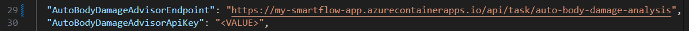
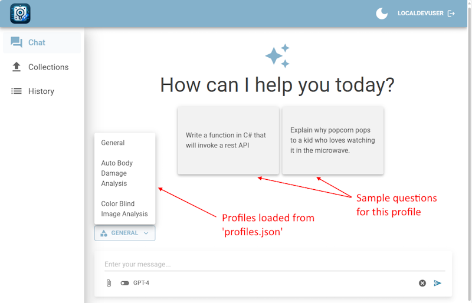
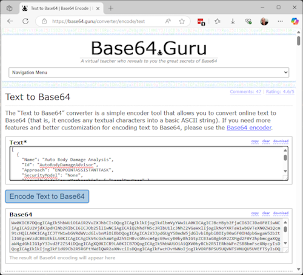

# Smart Flow UI Application

This project is a demonstration of how to create a simple UI that builds on top of an existing SmartFlow landing zone.  This UI is really just a shell and will call the API defined in the SmartFlow API project to run the agentic workflows.

## Contents

* [Architecture and Overview](#architecture-and-overview)
* [Getting Started with IAC](#getting-started-with-iac-and-deployment)
* [Local Development](#application-development-and-refinement)
* [Creating SmartFlow API Profiles](#creating-smartflow-api-profiles)

## Architecture and Overview

The SmartFlow solution is deployed using Azure Container Apps to run the API application, and there are other companion repositories that can provide UIs in the form of a website, a Teams app, and a phone client that will interact with this API.

While developing this API, a Swagger interface and some simple REST Client API tests are provided to enable you to develop a working API that will use OpenAI tools to analyze documents and provide feedback. The prompts and processes are easily configurable and can be modified to suit your needs.

---

## Note: This is a companion app!

Note: This is a companion app to the [SmartFlow API application](https://github.com/msft-mfg-ai/smart-flow-public). This project is designed to be installed after and on top of the SmartFlow app.  It will use all of the existing resources and simply add a new Container App containing the UI.

For an easy and optimal deployment experience, copy all of the secrets and variables that you used in the the SmartFlow API deploy to this application's repository variables and secrets, then kick off the primary GitHub Workflow or Azure DevOps pipeline, and it should be good to go.

If you want to use `azd up`, you will want to use the same variables to match the existing SmartFlow API application.  Copy the AZD setting values from the Smart-Flow-Public project (i.e. the entire `.azure` folder), then add in the two variables `APP_NAME_NO_DASHES="xxxx"` and `ENVIRONMENT_NAME="dev"` and then the azd up command should work right off first time as designed.

---

## Getting Started with IAC and Deployment

This project uses Infrastructure as Code (IaC) to deploy and manage the Azure resources, utilizing [Bicep](https://learn.microsoft.com/en-us/azure/azure-resource-manager/bicep/overview) to deploy Azure resources declaratively. In this case, most everything is deploy already in the SmartFlow Landing Zone, and this project will simply add a new Container App to that existing environment.

To begin using this demo, you will need to:

1. Fork this repository (or import it into your own environment)
1. Create a service principal with rights to deploy resources
1. Configure some environment variables
1. Deploy the initial Azure resources
1. Start modifying the code to meet your requirements

For more details and to get started, choose one of the following setup guides:

* [GitHub Actions Setup](./.github/setup.md)
* [Azure DevOps Setup](./.azdo/pipelines/readme.md)
* [azd up](./docs/azd_deploy.md)

---

## Application Development and Refinement

You can start doing local development right after you have deployed the SmartFlow API application and use this UI to call the APIs that were created in that application.

To run the UI application, open the [app/SmartFlowUI/SmartFlowUI.sln](./app/SmartFlowUI/SmartFlowUI.sln) in Visual Studio (or VS Code). There are only a few secrets required and they are defined the [app/SmartFlowUI/backend/appsettings.Template.json](./app/SmartFlowUI/backend/appsettings.Template.json) file.  Mostly you will configure `profiles` and then put the keys and URLs for those profiles in your app settings or user secrets.

> You can set up these values in the user secrets by right-clicking on the Project and selecting `Manage User Secrets`, or you can add those values into the [appsettings.json](./app/SmartFlowUI/backend/Services/Profile/profiles.json) or appsettings.development.json file, ***(just be sure not to check those values into source control if you update the appsettings.json files!)***  Tip: If you want to use `Manage User Secrets` in VS Code you can use [this extension](https://marketplace.visualstudio.com/items?itemName=adrianwilczynski.user-secrets).

## Creating SmartFlow API Profiles

The prompts that are defined in the SmartFlow API should be represented as profiles in the [app/SmartFlowUI/backend/Services/Profile/profiles.json](./app/SmartFlowUI/backend/Services/Profile/profiles.json) file. You can add new prompts or modify existing ones to suit your needs.

Here's an example that is part of the initial API deploy:

The `Auto Body Damage Analysis` is one of the samples provided with the base SmartFlow API. We've added it here with an approach of `ENDPOINTASSISTANTTASK`.  The three keys that are critical here are the `APIEndpointSetting`, `APIEndpointKeySetting`, and `AllowFileUpload`. The `AllowFileUpload` key is a boolean value that indicates whether or not you want to allow the user to upload files for this profile.

The values that you put in the `APIEndpointSetting` and `APIEndpointKeySetting` need to have corresponding values in the appsettings.json file or the User Secrets, like this:

When the app is loaded and runs, it will process the `profiles.json` file and create a list of profiles that are available to the user.  The user can select one of those profiles and call those actions.

---

## Alternate Profile Sources

Once the UI is deployed, you can also change the profiles defined by specifying one of two alternate locations for the profile data. In that way, you can update the profiles supplied without having to redeploy the application each time.

The profiles are loaded in priority order, starting with the Storage Account, then looking for a ProfileConfiguration environment key, then defaulting finally to the `profiles.json` file.

### 1. Storage Account

If you create an environment key named `ProfileConfigurationBlobStorageContainer`, the application will look in that container for a file named `profiles.json`.  This file will be used to override the profiles defined in the `profiles.json` file in the application.

### 2. Environment Key

If you create an environment key named `ProfileConfiguration`, the application will use that data to override the profiles defined in the `profiles.json` file in the application. It is expected that the key value would contain a JSON string that is contains exactly what would be in the `profiles.json` file. However, that data must be Base 64 encoded as it will be Base64 decoded when it is read.

Create your `profiles.json` file locally, then use a tool like [https://base64.guru/converter/encode/text](https://base64.guru/converter/encode/text) (or some other tool you have access to) to encode the file.  Create an environment key named `ProfileConfiguration` and paste the Base 64 encoded string into the value.

### 3. Profiles.Json File

Lastly, if neither of the previous two options are specified, the application will use the values in `profiles.json` file to configure the application.

---

Once you have your profiles configured, you should be able to test any of the APIs you have deployed in the SmartFlow API application.

---

## References

* [Private Networking in Azure Container Apps environment](https://learn.microsoft.com/en-us/azure/container-apps/networking)
* [OpenAI: Questions and Answers using embeddings](https://cookbook.openai.com/examples/question_answering_using_embeddings)

---

[Back to top](#contents)
